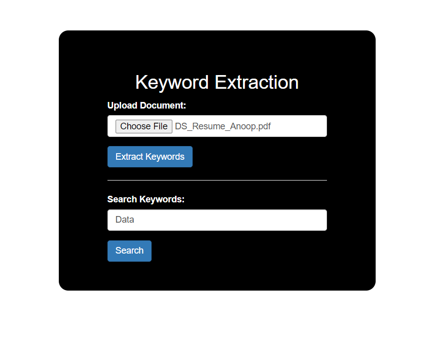
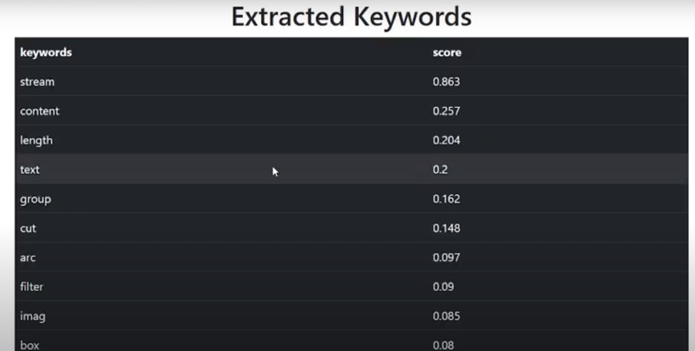
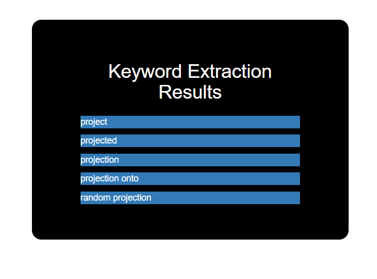

## Overview
Welcome to the Keyword Extractor Web Application! This application leverages advanced natural language processing techniques to extract meaningful keywords from textual content. Whether you're analyzing documents or seeking to enhance information retrieval, this app provides a streamlined and efficient solution.

## Features
- **Keyword Extraction:** Extract relevant keywords from documents.
- **Data Preprocessing:** Clean and preprocess text for optimal results.
- **TF-IDF Analysis:** Utilize Term Frequency-Inverse Document Frequency for robust analysis.
- **Search Functionality:** Search for specific keywords within the application.

## Screenshots
Below are screenshots showcasing different pages and functionalities of the application:

1. **Home Page ('/')**
   

2. **Keyword Extraction ('/extract_keywords')**
   

3. **Keyword Search ('/search_keywords')**
   

## Getting Started
To run the application locally, follow these steps:

1. Clone the repository: `git clone https://github.com/anoopgupta112/Keyword-Extractor-App.git`
2. Install dependencies: `pip install -r requirements.txt`
3. Run the application: `python app.py`

## Dependencies
- Flask
- NLTK
- scikit-learn
- Other dependencies listed in `requirements.txt`
